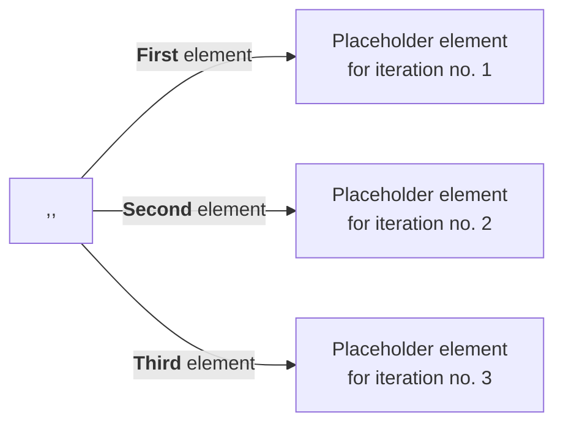
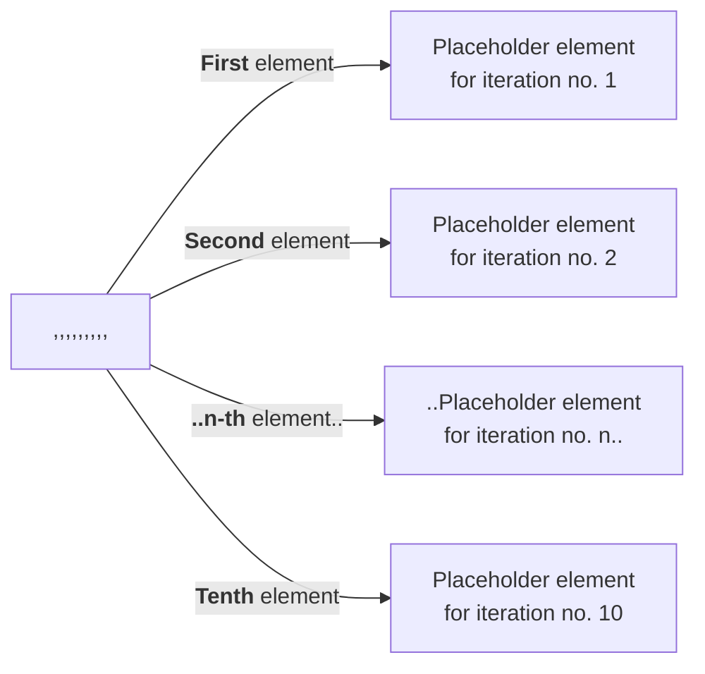

# CreateListOfSequentialNumbers

---

## Problem Statement

Deluge does not support creating ranges of numbers by default, which might be helpful for cases when you want to only iterate over a given set of numbers - such as a `WHILE.. LOOP` in some known programming languages.

> An example of ranges of numbers is like how you can easily do so in another scripting language like Python.
> Click [here](https://pynative.com/python-range-function/) to read on the Python implementation.
 

---

## Solution

There are many ways to do so by hardcoding values (through typing, or populating a list with an online tool, through a Google Sheets formula..), but by leveraging Deluge's assumption of automatically converting a *string of data* with commas into a list, we can leverage the `repeat()` function to do so.

> Read up on the `repeat()` function [here](https://www.zoho.com/deluge/help/functions/string/repeat.html).
> 

If weÕre new to Deluge, we would do something like:

```jsx
listRange = [1,2,3,4,5,6,7,8,9,10];
```

Which is sensible and easy.. if weÕre doing up to 10 numbers.

But what if we wanted a range of numbers up to 100? Or up to 1000?

.. Or up to _59,381_?

To a certain degree, thatÕs when we can use Google Sheets to perform this through the `=SEQUENCE()` formula, but even performing a `TEXTJOIN()` will hit limitations when dealing with long text strings.

Using DelugeÕs `repeat()` function will help us out in this space.

Bear in mind, you will need to think about the final number of instances, then subtract it by 1, to parse as the 2nd argument into `repeat()`.

Due to the nature of splitting comma delimited texts, you will split from one text string to a number of text strings when it is split by commas.



For the case above, if we are intending to create a list size of 3, we will need to only populate 2 commas, which will look something like:

```jsx
listRange = repeat(",",2);
info listRange;
//returns ,,
```

If we wanted 10..

```jsx
listRange = repeat(",",9);
info listRange;
//returns ,,,,,,,,,
```

This will look like the following:



And if we wanted 100..

```jsx
listRange = repeat(",",99);
info listRange;
//returns 99 instances of commas
```

And, unnecessarily, the original example of 59,381..

```jsx
listRange = repeat(",",59380);
info listRange;
//returns 59380 instances of commas
```

But if you were run `info listRange;`, then you will get a size of 3, 10, 100 and 59381 respectively for the examples above.

Though the results of this will produce a number of commas, but Deluge automatically converts this to a List data type, which allows us to leverage this automatic conversion as elements, which fits very well into a `for each` loop to replicate a `WHILE .. LOOP` to only iterate through a certain set of numbers.